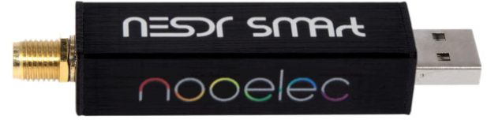
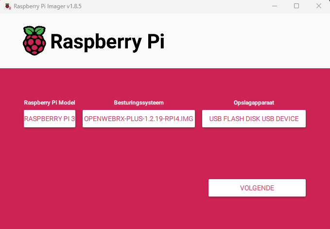

# OpenwebRX
### Installatie & Configuratie OpenwebRx door ON3PDY.
---
## Benodigheden

Als platform gebruiken we een Raspberry Pi, dit is een kleine singleboardcomputer met een ARM-processor.
Deze is verkrijgbaar in verschillende versies, Vanaf een versie3 (V3) is deze geschikt voor onze webSDR

Sterk aanbevolen is een Versie 4 met 8Mb, deze is net wat krachtiger en geeft hierdoor een vlotte werking.


**S.D.R's**

Hier zijn verschillende keuze's mogelijk, zo heeft elke sdr voordelen of nadelen. (prijs, bereik, enz.)

Persoonlijk heb ik deze 3 modellen in mijn shack. 
- RTL-SDR
- NooElec
- SdrPlay



**Programma's**
- [Raspberry Pi Imager](https://www.raspberrypi.com/software/)
- [PuTTY](https://www.chiark.greenend.org.uk/~sgtatham/putty/latest.html)
- [Angry IP Scanner](https://github.com/angryip/ipscan/releases/download/3.9.1/ipscan-3.9.1-setup.exe)


## Installatie 

Download de laatste versie via volgende link: [OpenwebRx luarvique](https://github.com/luarvique/ppa)

Schrijf het bestand naar een **SD kaart** of **USB stick** met behulp van **Raspberry Pi Imager**



## Instellen van systeem gebruiker & paswoord !


Kies hier voor **AANPASSEN** om onderstaand dialoog te openen.


- *Hostnaam* ==> vrije keuze voorbeeld: OpenwebRX
- *Gebruikersnaam* ==> vrije keuze voorbeeld: sdr
- *Wachtwoord* ==> vrije keuze (opgelet deze is alleen voor het OS)
- *Wiffi instellen* ==> kan je eventueel overslaan maar kan wel handig zijn om straks te configuren.
- Regio instellingen *Tijdzone:* Europa/Brussels en *Toetsenbord indeling:* be

kies **Opslaan** om deze gegevens te bewaren en toe te passen.

Om verbinding van op afstand te kunnen maken moet SSH worden geactiveerd.

Maak een nieuw leeg tekstbestand aan in de root map en deze te hernoemen naar ssh (zonder extentie!)


Steek de SD kaart in de Raspberry PI en wacht tot deze is opgestart.

## Hoe benaderen en inloggen op de Raspberry Pi? ##
Via een computer in het zelfde netwerk als de Raspeberry Pi kan je inloggen via een programma. 

log in met de gebruikersnaam en paswoord dat is opgegegeven in 'Raspberry Pi Imager'
eerst zorgen we dat het OS volledig up to date is.
sudo apt-get update
sudo apt-get upgrade
sudo rpi-update (eenmalig de firmware updaten)
sudo openwebrx admin adduser SDR (kies een paswoord)
sudo reboot
#installing digital modes
sudo install-softmbe.sh
#installing plugins
https://github.com/0xAF/openwebrxplus-plugins

ifconfig
http://localhost:8073/


---
# Markdown Cheat Sheet

Thanks for visiting [The Markdown Guide](https://www.markdownguide.org)!

This Markdown cheat sheet provides a quick overview of all the Markdown syntax elements. It can’t cover every edge case, so if you need more information about any of these elements, refer to the reference guides for [basic syntax](https://www.markdownguide.org/basic-syntax/) and [extended syntax](https://www.markdownguide.org/extended-syntax/).

## Basic Syntax

These are the elements outlined in John Gruber’s original design document. All Markdown applications support these elements.

### Heading

# H1
## H2
### H3

### Bold

**bold text**

### Italic

*italicized text*

### Blockquote

> blockquote

### Ordered List

1. First item
2. Second item
3. Third item

### Unordered List

- First item
- Second item
- Third item

### Code

`code`

### Horizontal Rule

---

### Link

[Markdown Guide](https://www.markdownguide.org)

### Image


## Extended Syntax

These elements extend the basic syntax by adding additional features. Not all Markdown applications support these elements.

### Table

| Syntax | Description |
| ----------- | ----------- |
| Header | Title |
| Paragraph | Text |

### Fenced Code Block

```
{
  "firstName": "John",
  "lastName": "Smith",
  "age": 25
}
```

### Footnote

Here's a sentence with a footnote. [^1]

[^1]: This is the footnote.

### Heading ID

### My Great Heading {#custom-id}

### Definition List

term
: definition

### Strikethrough

~~The world is flat.~~

### Task List

- [x] Write the press release
- [ ] Update the website
- [ ] Contact the media

### Emoji

That is so funny! :joy:

(See also [Copying and Pasting Emoji](https://www.markdownguide.org/extended-syntax/#copying-and-pasting-emoji))

### Highlight

I need to highlight these ==very important words==.

### Subscript

H~2~O

### Superscript

X^2^
