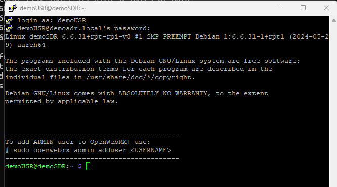

### OpenwebRX  Installatie & Configuratie door ON3PDY. ###
---
## Benodigdheden ##
      

[**Raspberry Pi**](https://www.kiwi-electronics.com/nl/raspberry-pi-boards-behuizingen-uitbreidingen-en-accessoires-59/raspberry-pi-5-4gb-11579?_gl=1*lkf79s*_up*MQ..&gclid=CjwKCAjw6c63BhAiEiwAF0EH1Hk4vvkVqG9C-TbIWwtMIr4HgenyoZ5aiTEVGVtE6QI5oQILqpdzXhoClmwQAvD_BwE)
Dit is een kleine singleboardcomputer met een ARM-processor.

Deze isn verkrijgbaar in verschillende versies.
Alle versies vanaf een V3 kunnen dienen voor dit project.

[**Behuizing & Koeling**](https://www.kiwi-electronics.com/nl/raspberry-pi-boards-behuizingen-uitbreidingen-en-accessoires-59/raspberry-pi-behuizing-voor-pi-5-zwart-11584?_gl=1*1a7n6vn*_up*MQ..&gclid=CjwKCAjw6c63BhAiEiwAF0EH1Hk4vvkVqG9C-TbIWwtMIr4HgenyoZ5aiTEVGVtE6QI5oQILqpdzXhoClmwQAvD_BwE)
behuizing voor de Raspberry Pi.

[**Voeding**](https://www.kiwi-electronics.com/nl/raspberry-pi-boards-behuizingen-uitbreidingen-en-accessoires-59/raspberry-pi-27w-usb-c-power-supply-zwart-eu-11582?_gl=1*p4xdg9*_up*MQ..&gclid=CjwKCAjw6c63BhAiEiwAF0EH1Hk4vvkVqG9C-TbIWwtMIr4HgenyoZ5aiTEVGVtE6QI5oQILqpdzXhoClmwQAvD_BwE)
Voeding 5.1V - minimum Ampere hangt af van de gebruikte Versie van Raspberry Pi.

[**SD kaart**](https://www.kiwi-electronics.com/nl/transcend-32gb-microsd-premium-class-10-uhs-i-plus-adapter-303?search=sd%20kaart)
MicroSD kaart minimaal 8Gb.

**S.D.R's**

SDR-dongles zijn oorspronkelijk ontworpen voor DVB-T HDTV-ontvangst, maar ze zijn prima bruikbaar als SDR.

[**RTL-SDR V3**](https://www.vandijkenelektronica.nl/product/rtl-sdr-v3-tcxo-dongle-500khz-1700mhz-sma-aansluiting/) (is wat ik in gebruik heb)

[**RTL-SDR V4**](https://www.vandijkenelektronica.nl/product/rtl-sdr-v4-tcxo-dongle-500khz-1700mhz-sma-aansluiting/) (geen ervaring mee!)

Persoonlijk heb ik deze modellen in mijn shack. 
- RTL-SDR
- SdrPlay

**Programma's**
- [Raspberry Pi Imager](https://www.raspberrypi.com/software/)
- [PuTTY](https://www.chiark.greenend.org.uk/~sgtatham/putty/latest.html)

---

## Installatie ##

Download de laatste versie via volgende link: [OpenwebRx luarvique](https://github.com/luarvique/openwebrx/releases/)

Schrijf het bestand naar de **SD kaart** met behulp van het programma **Raspberry Pi Imager**

## Instellen van systeem gebruiker & paswoord! ##

Kies hier voor **AANPASSEN** om onderstaand dialoog te openen.

- *Hostnaam* ==> vrije keuze voorbeeld: demoSDR
- *Gebruikersnaam* ==> vrije keuze voorbeeld: demoUSR
- *Wachtwoord* ==> vrije keuze demo (opgelet deze is alleen voor het OS)
- *Wiffi instellen* ==> kan je eventueel overslaan maar kan wel handig zijn om straks te configuren.
- Regio instellingen *Tijdzone:* **Europa/Brussels** en *Toetsenbord indeling:* **be**

Kies **Opslaan** om deze gegevens te bewaren en toe te passen.

Klik op **ja** voor deze waarschuwing

mogelijk komt er een bestandsverkener scherm open (negeer waarschuwing en sluit dit)

De image wordt nu op de SDkaart geinstalleerd.

De installatie wordt geverifieerd

Verwijder de SDkaart uit je PC en klik op VERDER GAAN

Om verbinding van op afstand te kunnen maken moet SSH nog worden geactiveerd.

Steek de SDkaart terug in je PC en maak een nieuw leeg tekstbestand aan in de root map met als naam **ssh** (zonder extentie!)

**De eerste opstart van OpenWebRx**

- Steek de SD kaart in de Raspberry PI.
- Sluit de RPI aan in het netwerk.
- sluit de SDR dongle aan op 1 van de USB poorten.
- Sluit de voeding aan en wacht tot deze is opgestart.

Als alles goed is verlopen kan je nu de OpenWebRx openen in je netwerk. **http://demosdr.local:8073/**

## Inloggen op de Raspberry Pi vanop afstand ##
Via een computer in het zelfde netwerk als deze van de Raspeberry Pi kan je inloggen via **SSH** met het programma **PuTTY**.

Hiervoor heb je volgende gegevens voor nodig.
- IP adres van de Raspberry Pi of de hostname **(demosdr.local)**
- gebruikersnaam
- Wachtwoord

De gebruikersnaam en paswoord is wat je hebt opgegegeven in de 'Raspberry Pi Imager'

IP adres: hier moeten we eerst opzoek gaan naar wat er via DHCP is toegekend aan de Raspberry Pi.

Via de opdrachtpromt (CMD) kunnen we dit vinden: ping de hostname die je hebt opgegegeven in 'Raspberry Pi Imager'

`ping demoSDR`

De allereerste keer de PC een verbinding maakt krijg je dit scherm te zien. klik op JA om verder te gaan.

Eerst zorgen we dat het OS volledig up to date is. (de allereerste keer kan dit lang duren, geduld ...)

`sudo apt-get update`

`sudo apt-get upgrade -y`

`sudo reboot`

`sudo rpi-update` (**eenmalig** de firmware updaten als je werkt met een oudere V3 RPI)

Log opnieuw in op de RPI om een OpenWebRx admin web gebruiker en wachtwoord instellen.

`sudo openwebrx admin adduser XXXX` (XXXX vervangen door een gebruikersnaam en kies een paswoord)

Deze zijn ook interesante commando's betreft gebruiker administratie.

`sudo openwebrx admin adduser` [username]            Add a new user

`sudo openwebrx admin removeuser` [username]         Remove an existing user

`sudo openwebrx admin resetpassword` [username]      Reset a user's password

`sudo openwebrx admin disableuser` [username]        Disable a user

`sudo openwebrx admin enableuser` [username]         Enable a user

`sudo openwebrx admin listusers`                     List enabled users

`sudo openwebrx admin hasuser`                       Test if a user exists

### Installing digital modes ###

Nu we toch op het OS zijn ingelogd gaan we nog wat extra digitale decoders installeren. (niet verplicht)

`sudo install-softmbe.sh`

### Configureren van de WebSdr ###

### installing plugins ###
[openwebrxplus-plugins](https://github.com/0xAF/openwebrxplus-plugins)

Om een ​​plugin(s) te laden moet je een **init.js** bestand aanmaken in je openwebrx installatie.

Om de juiste map te vinden waar bestand moet staan, gebruik je volgend commando.  `sudo find / -name openwebrx.js`

`cd /usr/lib/python3/dist-packages/htdocs/plugins/receiver`    vervang **openwebrx.js** door **plugins/receiver**

Tip: wil je zien wat er in deze map staat gebruik **ls -a**

We kopieren het aanwezige voorbeeld naar een nieuw bestand met de juiste naam.  `sudo cp init.js.sample init.js`

Nu gaan we dit bestand editeren met het commando `sudo nano init.js`

schakel over naar RAW mode en kopier wat TUSSEN de @ staat in je klembord.
@

// Plugin initialization.
// First load the utils, needed for some plugins
Plugins.load('https://0xaf.github.io/openwebrxplus-plugins/receiver/utils/utils.js').then(async function () {
  Plugins.load('https://0xaf.github.io/openwebrxplus-plugins/receiver/utils/utils.js')
    .then(async function () {
    Plugins.load('https://0xaf.github.io/openwebrxplus-plugins/receiver/frequency_far_jump/frequency_far_jump.js');
    await Plugins.load('https://0xaf.github.io/openwebrxplus-plugins/receiver/notify/notify.js');
    Plugins.load('https://0xaf.github.io/openwebrxplus-plugins/receiver/keyboard_shortcuts/keyboard_shortcuts.js');
    Plugins.load('https://0xaf.github.io/openwebrxplus-plugins/map/layer_qth_maidenhead/layer_qth_maidenhead.js');
    Plugins.load('https://0xaf.github.io/openwebrxplus-plugins/receiver/sort_profiles/sort_profiles.js');
    Plugins.load('https://0xaf.github.io/openwebrxplus-plugins/receiver/tune_checkbox/tune_checkbox.js');
  });
});

@
sudo systemctl restart varnish nginx

---

Aanbevolen is de RPI een vast IP adres geven. (niet verplicht)

Hiervoor doen we eerst wat opzoeken betrefende het netwerk waarmee we verbonden zijn.

Opniew gebruiken we hiervoor de opdrachtprompt (CMD)  

`ipconfig`

Scrol tot je de gegevens van de *Ethernet adapter* ziet. Noteer hier de **Default Gateway**

nu zijn we klaar om via **PuTTY** de instelling van de RPI aan te passen. Hiervoor heeft de RPI een ingebouwde editor. **NANO**

`sudo nano /etc/dhcpcd.conf`

zoek naar **Example static IP configuration van interface eth0** verwijder de # vooraan en pas het voorbeeld aan.

TIP: gebruik als static ip_address dat wat via DHCP is toegekend aan de Raspberry Pi. (zo ben je zeker van geen conflicten!).

static routers en static domain_name_servers daar gebruik je de **Default Gateway** die je hebt verkregen via **ipconfig**

- static ip_address=192.168.1.47/24 (opgelet /24 moet achteraan het gewenste IP adres staan!)
- static routers=192.168.1.1
- static domain_name_servers=192.168.1.1

Sluit af met de toetsencombinatie **CTRL+X** en bevestig met **Y**

https://stackoverflow.com/questions/31264165/can-i-share-my-private-github-repository-by-link

Generate an invitation URL with a 1-week lifespan

Get a temporary email address - e.g. using https://temp-mail.org/

In your repository, go to "Settings" -> "Collaborators and teams" -> "Add people", enter the temporary email address, click "Invite to {your repo}" enter image description here

Select the permission level you want this invite link to have, and click "Add {email}"

In your temporary mailbox, you should receive the email containing an invitation link: enter image description here

Right click on "View invitation" and copy the link.

This link should look something like:

https://github.com/{username}/{repository}/invitations?invitation_token=xxxxxxxxxxxxx

