### OpenwebRX  Installatie & Configuratie door ON3PDY. ###
---
## Benodigdheden ##
      

[**Raspberry Pi**](https://www.kiwi-electronics.com/nl/raspberry-pi-boards-behuizingen-uitbreidingen-en-accessoires-59/raspberry-pi-5-4gb-11579?_gl=1*lkf79s*_up*MQ..&gclid=CjwKCAjw6c63BhAiEiwAF0EH1Hk4vvkVqG9C-TbIWwtMIr4HgenyoZ5aiTEVGVtE6QI5oQILqpdzXhoClmwQAvD_BwE)
Dit is een kleine singleboardcomputer met een ARM-processor.

Deze is in verkrijgbaar in verschillende versies.
Alle versies vanaf een V3 kunnen dienen voor dit project.

[**Behuizing & Koeling**](https://www.kiwi-electronics.com/nl/raspberry-pi-boards-behuizingen-uitbreidingen-en-accessoires-59/raspberry-pi-behuizing-voor-pi-5-zwart-11584?_gl=1*1a7n6vn*_up*MQ..&gclid=CjwKCAjw6c63BhAiEiwAF0EH1Hk4vvkVqG9C-TbIWwtMIr4HgenyoZ5aiTEVGVtE6QI5oQILqpdzXhoClmwQAvD_BwE)

[**Voeding**](https://www.kiwi-electronics.com/nl/raspberry-pi-boards-behuizingen-uitbreidingen-en-accessoires-59/raspberry-pi-27w-usb-c-power-supply-zwart-eu-11582?_gl=1*p4xdg9*_up*MQ..&gclid=CjwKCAjw6c63BhAiEiwAF0EH1Hk4vvkVqG9C-TbIWwtMIr4HgenyoZ5aiTEVGVtE6QI5oQILqpdzXhoClmwQAvD_BwE)
Voeding 5.1V - aansluiting en vermogen hangen af van de gebruikte Raspberry Pi versie.

[**SD kaart**](https://www.kiwi-electronics.com/nl/transcend-32gb-microsd-premium-class-10-uhs-i-plus-adapter-303?search=sd%20kaart)
MicroSD kaart minimaal 8Gb.

**S.D.R's**

SDR-dongles zijn oorspronkelijk ontworpen voor DVB-T HDTV-ontvangst, maar ze zijn prima bruikbaar als SDR.

[**RTL-SDR V3**](https://www.vandijkenelektronica.nl/product/rtl-sdr-v3-tcxo-dongle-500khz-1700mhz-sma-aansluiting/) (is wat ik in gebruik heb)

[**RTL-SDR V4**](https://www.vandijkenelektronica.nl/product/rtl-sdr-v4-tcxo-dongle-500khz-1700mhz-sma-aansluiting/) (geen ervaring mee!)

Persoonlijk heb ik deze modellen in mijn shack. 
- RTL-SDR
- SdrPlay

**Programma's**
- [Raspberry Pi Imager](https://www.raspberrypi.com/software/)
- [PuTTY](https://www.chiark.greenend.org.uk/~sgtatham/putty/latest.html)
- [Win32 Disk Imager](https://win32diskimager.org/)
- [balenaEtcher](https://balenaetcher.en.download.it/download)

---

## Installatie ##

Download de laatste versie via volgende link: [OpenwebRx luarvique](https://github.com/luarvique/openwebrx/releases/)

Kies hier voor het zip bestand (voor V3 32bit! voor V4 kan je zowel de 32 of 64bit versie gebruiken).

Schrijf het bestand naar de **SD kaart** met behulp van het programma **Raspberry Pi Imager**

## Instellen van systeem gebruiker & paswoord! ##

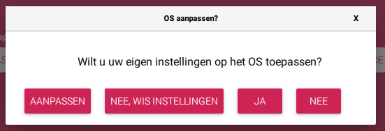

Kies hier voor **AANPASSEN** om onderstaand dialoog te openen.

- *Hostnaam* ==> vrije keuze voorbeeld: demoSDR
- *Gebruikersnaam* ==> vrije keuze voorbeeld: demoUSR
- *Wachtwoord* ==> vrije keuze demo (opgelet deze is alleen voor het OS)
- *Wiffi instellen* ==> kan je eventueel overslaan maar kan wel handig zijn om straks te configuren.
- Regio instellingen *Tijdzone:* **Europa/Brussels** en *Toetsenbord indeling:* **be**

Kies **Opslaan** om deze gegevens te bewaren en toe te passen.

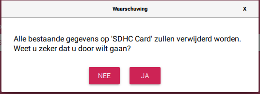

Klik op **ja** voor deze waarschuwing

mogelijk komt er een bestandsverkener scherm open (negeer waarschuwing en sluit dit)

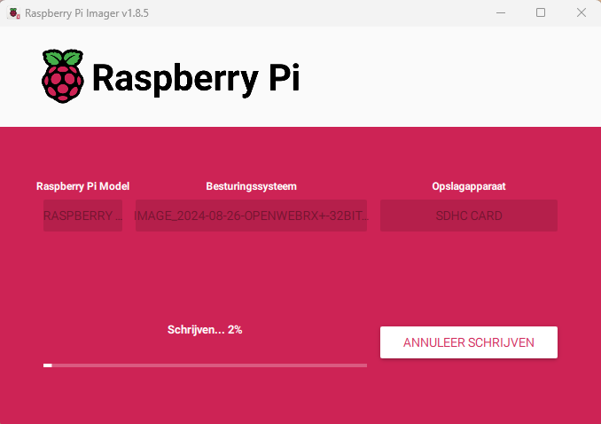
De image wordt nu op de SDkaart geinstalleerd.

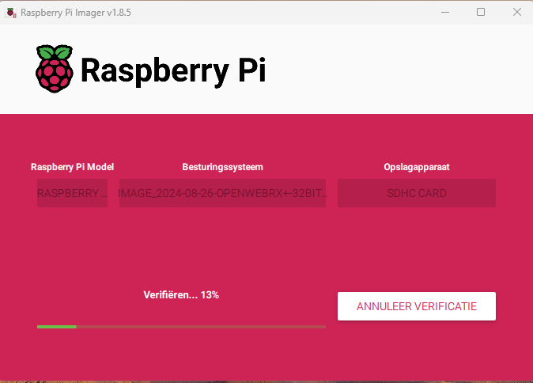
De installatie wordt geverifieerd

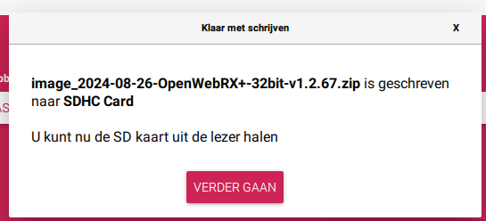
Verwijder de SDkaart uit je PC en klik op VERDER GAAN

Om verbinding van op afstand te kunnen maken moet SSH nog worden geactiveerd.

Steek de SDkaart terug in je PC en maak een nieuw leeg tekstbestand aan in de root map met als naam **ssh** (zonder extentie!)

**De eerste opstart van OpenWebRx**

- Steek de SD kaart in de Raspberry PI.
- Sluit de RPI aan in het netwerk.
- sluit de SDR dongle aan op 1 van de USB poorten.
- Sluit de voeding aan en wacht tot deze is opgestart.

Als alles goed is verlopen kan je nu de OpenWebRx openen in je netwerk. **http://demosdr.local:8073/**

## Inloggen op de Raspberry Pi vanop afstand ##
Via een computer in het zelfde netwerk als deze van de Raspeberry Pi kan je inloggen via **SSH** met het programma **PuTTY**.

Hiervoor heb je volgende gegevens voor nodig.
- IP adres van de Raspberry Pi of de hostname **(demosdr.local)**
- gebruikersnaam
- Wachtwoord

De gebruikersnaam en paswoord is wat je hebt opgegegeven in de 'Raspberry Pi Imager'

IP adres: hier moeten we eerst opzoek gaan naar wat er via DHCP is toegekend aan de Raspberry Pi.

Via de opdrachtpromt (CMD) kunnen we dit vinden: ping de hostname die je hebt opgegegeven in 'Raspberry Pi Imager'

`ping demoSDR`

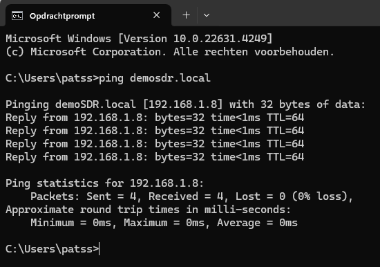

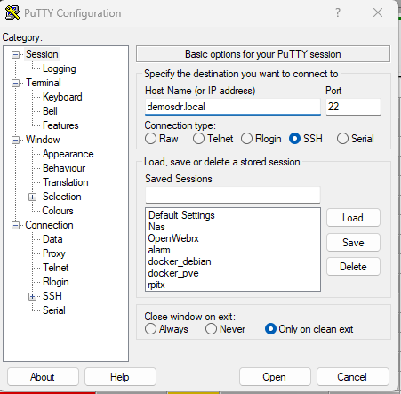

De allereerste keer de PC een verbinding maakt krijg je dit scherm te zien. klik op JA om verder te gaan.

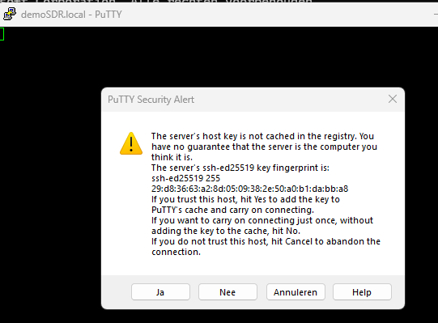

Eerst zorgen we dat het OS volledig up to date is. (de allereerste keer kan dit lang duren, geduld ...  +- 8 min)

`sudo apt-get update`

`sudo apt-get upgrade -y`

`sudo rpi-update` (**eenmalig** de firmware updaten als je werkt met een oudere V3 RPI) 

De image is zonder de digitale decoders (DMR, NXDN, etc.) via onderstaand commando gaan we deze toevoegen. (kan  lang duren, geduld ...  +- 12 min)

`sudo install-softmbe.sh`

Nu gaan we een adminin account maken om via de web interface de SDR te kunnen instellen en of aanpassen.

`sudo openwebrx admin adduser XXXX` (XXXX vervangen door een gebruikersnaam en kies een paswoord)

`sudo openwebrx admin adduser admin` als demo ook paswoord admin

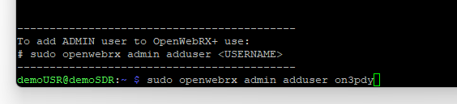

Nu gaan we herstarten zodat alle updates actief worden.

`sudo reboot`

Deze zijn ook interesante commando's betreft gebruiker administratie.

`sudo openwebrx admin adduser` [username]            Add a new user

`sudo openwebrx admin removeuser` [username]         Remove an existing user

`sudo openwebrx admin resetpassword` [username]      Reset a user's password

`sudo openwebrx admin disableuser` [username]        Disable a user

`sudo openwebrx admin enableuser` [username]         Enable a user

`sudo openwebrx admin listusers`                     List enabled users

`sudo openwebrx admin hasuser`                       Test if a user exists

>>> Een image met alle bovenstaande stappen reeds uitgevoerd is te vinden in je map als **websdr_demoUSR_demo_admin_admin.img** 

---
### Configureren van de WebSdr ###
---

**Settings ==> General Settings**

Receiver name = ON4TRV

Receiver location = Lubbeek, Belgium

Receiver elevation = 200

Receiver admin = info@trvrienden.be

Receiver band plan = ITU Region 1 (Africa, Europe, Middle East, North Asia)

Receiver coordinates 50,8821422       4,83844307581241

Photo title = Web SDR van de Toffe Radio Amateur Vrienden

Photo description = <IFRAME style=float:right marginWidth=0 marginHeight=0 src=https://www.dxfuncluster.com/widgets/cluster25.php frameBorder=1 scrolling=yes width=620 height=200></IFRAME>

Receiver Avatar + Receiver Panorama : upload bestanden

Allow users to change center frequency = aanvinken

Magic key = kies een wachtwoord indien je dit wenst. ==> http://localhost:8073/#freq=14000000,mod=usb,sql=-150 **,key=on4trv**

Waterfall color theme = Theme By Teejeez....

**Settings ==> SDR device settings**

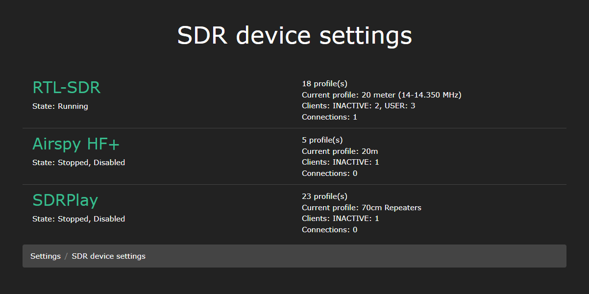
Schakel de Airspy HF+ en SDRPlay uit (tenzij je dergelijke SDR hebt)

**Settings ==> SDR device settings ==> RTL-SDR**

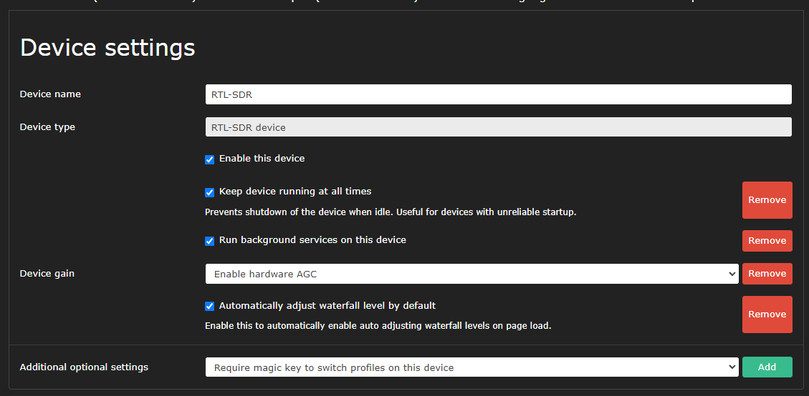

Maak de verschillende frequentie banden aan die je wenst te gebruiken.

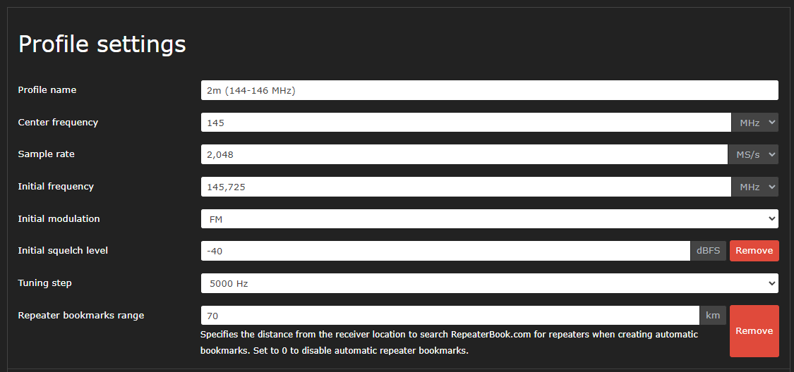
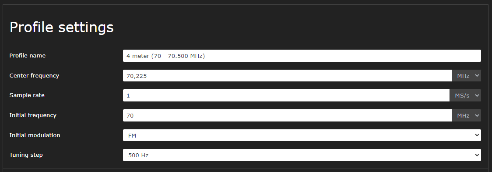

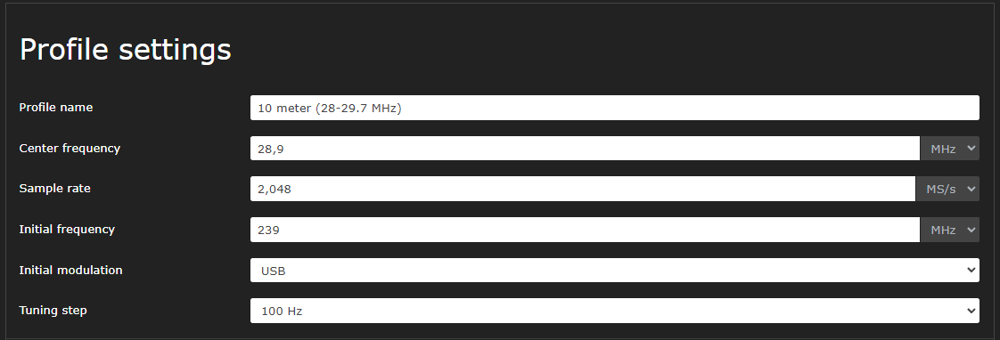

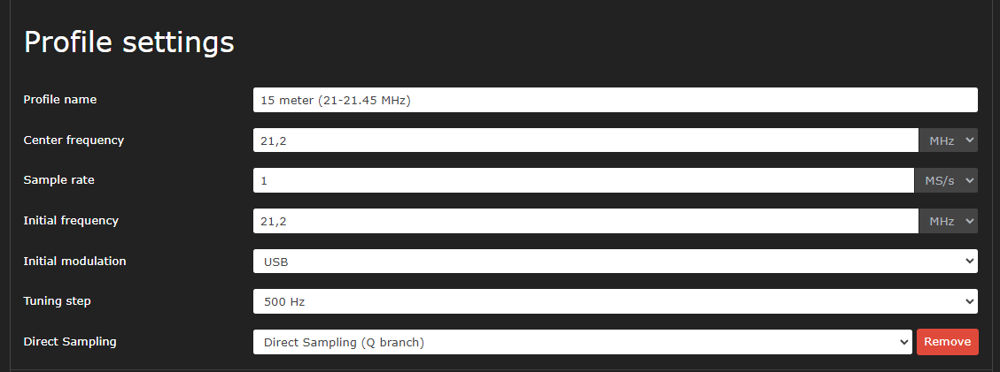

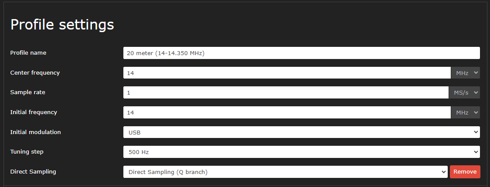
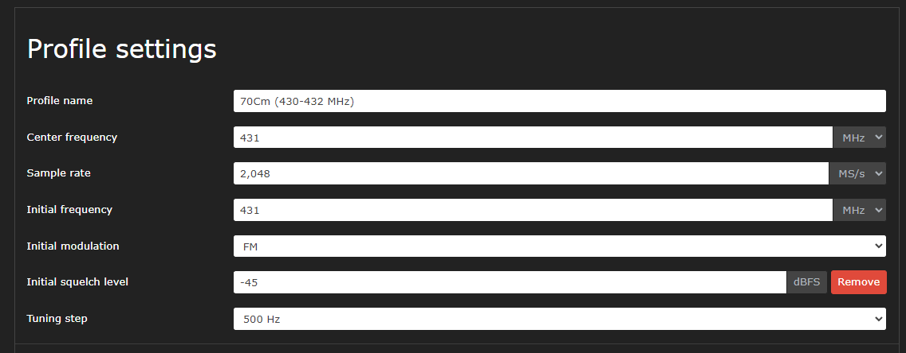
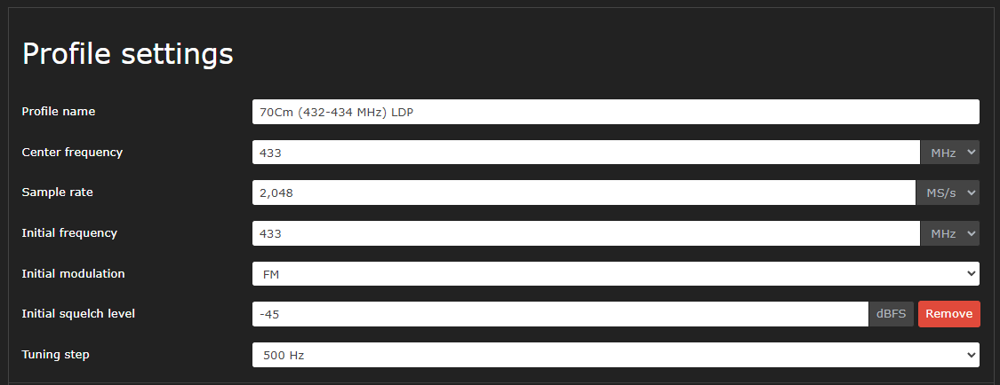
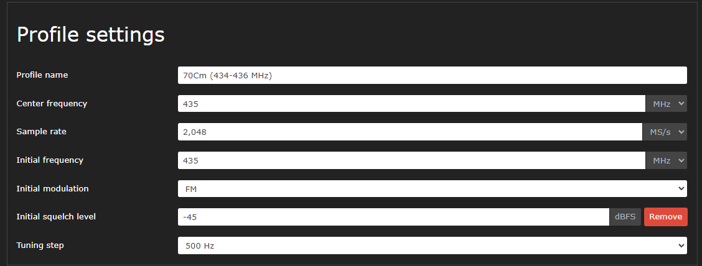

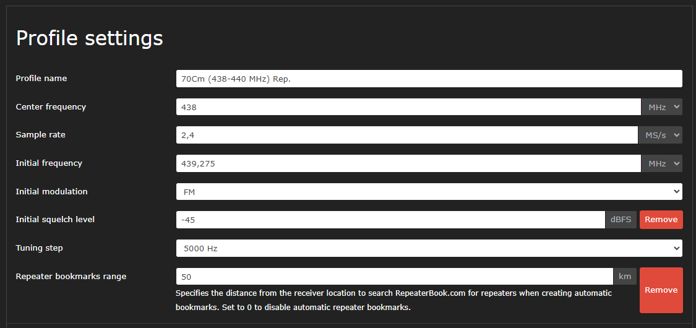

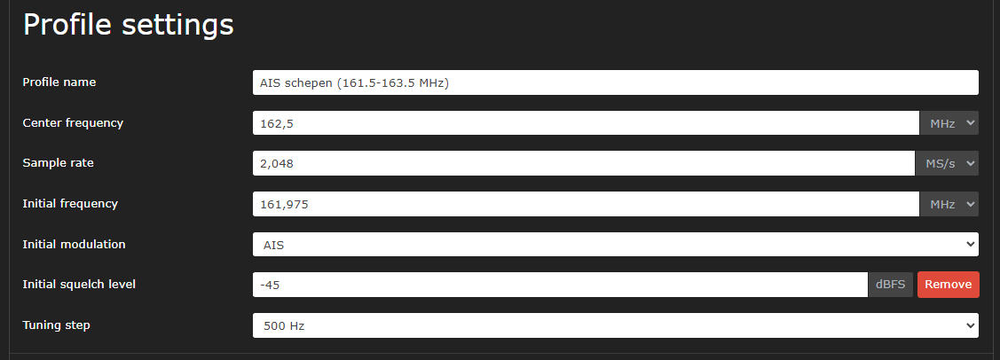

---

### installing plugins ###
[openwebrxplus-plugins](https://github.com/0xAF/openwebrxplus-plugins)

Om een ​​plugin(s) te laden moet je een **init.js** bestand aanmaken in je openwebrx installatie.

Om de juiste map te vinden waar bestand moet staan, gebruik je volgend commando.  `sudo find / -name openwebrx.js`

`cd /usr/lib/python3/dist-packages/htdocs/plugins/receiver`    vervang **openwebrx.js** door **plugins/receiver**

Tip: wil je zien wat er in deze map staat gebruik **ls -a**

We kopieren het aanwezige voorbeeld naar een nieuw bestand met de juiste naam.  `sudo cp init.js.sample init.js`

Nu gaan we dit bestand editeren met het commando `sudo nano init.js`

Eerst maken we het bestand compleet leeg zet cursor bovenaan (CTRL+K)

ga naar Plugins.json en bovenaan kies je kopier RAW

ga terug naar putty en via een rechts muis klik plak je de configuratie in het leeggemaakte bestand.

CTRL+X ==> save modified buffer Yes

sudo systemctl restart varnish nginx

---

Aanbevolen is de RPI een vast IP adres geven. (niet verplicht)

Hiervoor doen we eerst wat opzoeken betrefende het netwerk waarmee we verbonden zijn.

Opniew gebruiken we hiervoor de opdrachtprompt (CMD)  

`ipconfig`

Scrol tot je de gegevens van de *Ethernet adapter* ziet. Noteer hier de **Default Gateway**

nu zijn we klaar om via **PuTTY** de instelling van de RPI aan te passen. Hiervoor heeft de RPI een ingebouwde editor. **NANO**

`sudo nano /etc/dhcpcd.conf`

zoek naar **Example static IP configuration van interface eth0** verwijder de # vooraan en pas het voorbeeld aan.

TIP: gebruik als static ip_address dat wat via DHCP is toegekend aan de Raspberry Pi. (zo ben je zeker van geen conflicten!).

static routers en static domain_name_servers daar gebruik je de **Default Gateway** die je hebt verkregen via **ipconfig**

- static ip_address=192.168.1.47/24 (opgelet /24 moet achteraan het gewenste IP adres staan!)
- static routers=192.168.1.1
- static domain_name_servers=192.168.1.1

Sluit af met de toetsencombinatie **CTRL+X** en bevestig met **Y**

---

**BACKUP maken !!!**

hiervoor gebruik ik Win32 Disk Imager. 

Navigeer naar een folder en geef een zinvolle bestandsnaam op gevolgd door **.img**

Selecteer het juiste doelapparaat. Klik op Lezen en wacht tot het inlezen voltooid is.

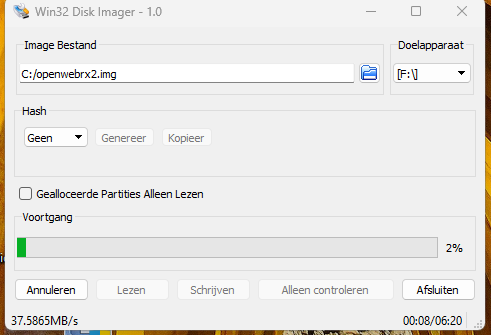

Bewaar dit op een veilige plaats Tip: bewaar ook de login gegevens op die plaats in een tekstbestand.

---

**Herstellen VIA een reeds opgeslagen backup**

Hiervoor gebruik ik bij voorkeur balenaEtcher (niet nodig om een zip of rar bestand uit te pakken)
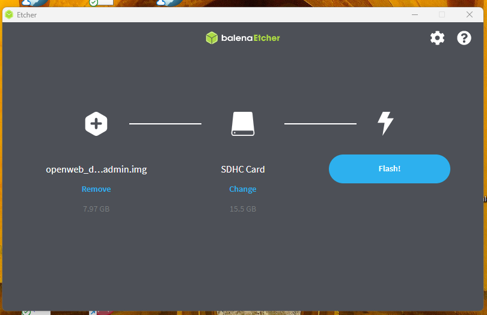

Na het schrijven de SDkaart terug in de RPI plaatsen en opstarten.

Krijg je onderstaande klik op annuleren en sluit het scherm.

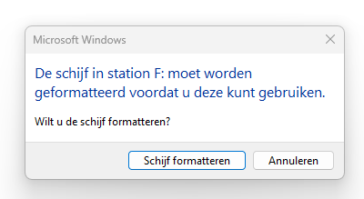

---

***Verander de Raspberry Pi Hostname***

`sudo raspi-config`

Selecteer Hostnaam en druk op Enter of selecteer Ok als u een waarschuwing krijgt waarin staat dat u geen speciale tekens mag gebruiken in de hostnaam van de Raspberry Pi.

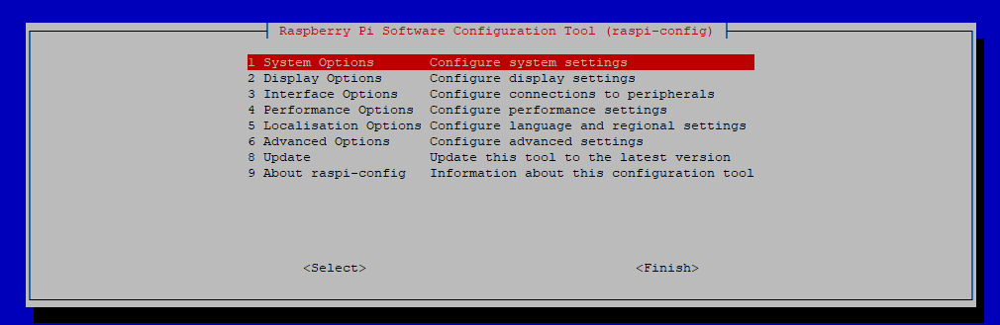
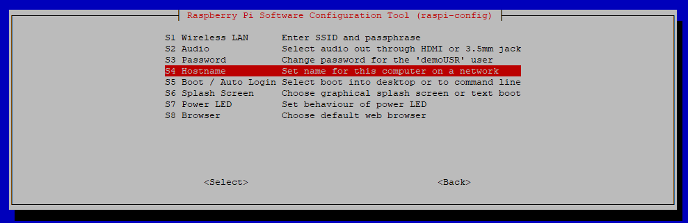
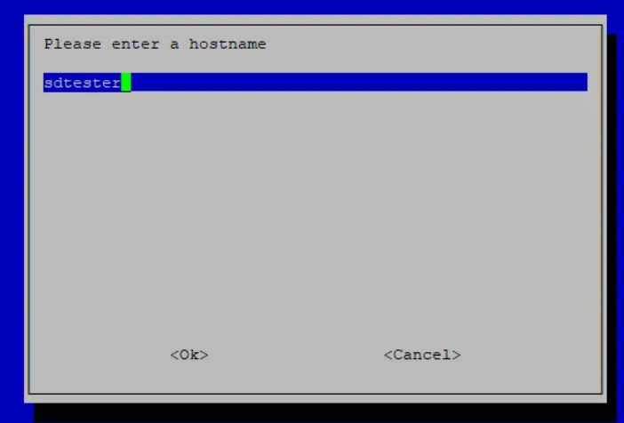
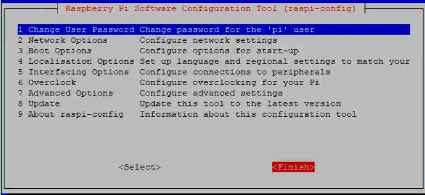
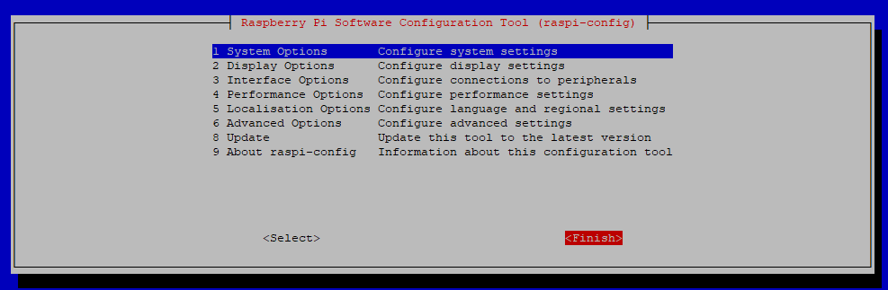
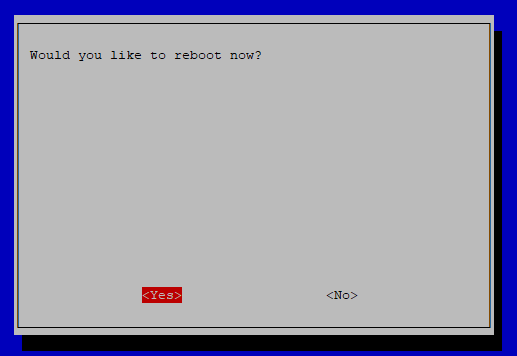

---

***User & Paswoord wijzigen***

`sudo adduser newuser_name`

`sudo usermod newuser_name -a -G openwebrx,adm,dialout,cdrom,sudo,audio,video,plugdev,games,users,input,netdev,spi,i2c,gpio`

---

Bookmarks aanpassen 

`cd /etc/openwebrx/bookmarks.d/`

`ls`

`sudo nano cb.json`

`sudo nano /var/lib/openwebrx/bookmarks.json`   (bevat de lokale bladwijzers die zelf zijn toegevoegd)

/etc/openwebrx/bookmarks.json   holds the additional bookmarks

[
    {
    "name": "TRV",
    "frequency": 144900000,
    "modulation": "nfm"
  },
  {
    "name": "2_m_example",
    "frequency": 145275000,
    "modulation": "nfm"
  },
  {
    "name": "70_cm_example",
    "frequency": 439000000,
    "modulation": "nfm"
  },
  {
        "name" : "CB1",
        "frequency" : 26965000,
        "modulation" : "fm"
   },
   {
       "name" : "CB2",
       "frequency" : 26975000,
       "modulation" : "fm"
   },
   {
       "name" : "CB3",
       "frequency" : 26985000,
       "modulation" : "fm"
   },
   {
       "name" : "CB4",
       "frequency" : 27005000,
       "modulation" : "fm"
   },
   {
       "name" : "CB5",
       "frequency" : 27015000,
       "modulation" : "fm"
   },
   {
       "name" : "CB6",
       "frequency" : 27025000,
       "modulation" : "fm"
   },
   {
       "name" : "CB7",
       "frequency" : 27035000,
       "modulation" : "fm"
   },
   {
       "name" : "CB8",
       "frequency" : 27055000,
       "modulation" : "fm"
   },
   {
       "name" : "CB9",
       "frequency" : 27065000,
       "modulation" : "fm"
   },
   {
       "name" : "CB10",
       "frequency" : 27075000,
       "modulation" : "fm"
   },
   {
       "name" : "CB11",
       "frequency" : 27085000,
       "modulation" : "fm"
   },
   {
       "name" : "CB12",
       "frequency" : 27105000,
       "modulation" : "fm"
   },
   {
       "name" : "CB13",
       "frequency" : 27115000,
       "modulation" : "fm"
   },
   {
       "name" : "CB14",
       "frequency" : 27125000,
       "modulation" : "fm"
   },
   {
       "name" : "CB15",
       "frequency" : 27135000,
       "modulation" : "fm"
   },
   {
       "name" : "CB16",
       "frequency" : 27155000,
       "modulation" : "fm"
   },
   {
       "name" : "CB17",
       "frequency" : 27165000,
       "modulation" : "fm"
   },
   {
       "name" : "CB18",
       "frequency" : 27175000,
       "modulation" : "fm"
   },
   {
       "name" : "CB19",
       "frequency" : 27185000,
       "modulation" : "fm"
   },
   {
       "name" : "CB20",
       "frequency" : 27205000,
       "modulation" : "fm"
   },
   {
       "name" : "CB21",
       "frequency" : 27215000,
       "modulation" : "fm"
   },
   {
      "name" : "CB22",
       "frequency" : 27225000,
       "modulation" : "fm"
   },
   {
       "name" : "CB23",
       "frequency" : 27255000,
       "modulation" : "fm"
   },
   {
       "name" : "CB24",
       "frequency" : 27235000,
       "modulation" : "fm"
   },
   {
       "name" : "CB25",
       "frequency" : 27245000,
       "modulation" : "fm"
   },
   {
       "name" : "CB26",
       "frequency" : 27265000,
       "modulation" : "fm"
   },
   {
       "name" : "CB27",
       "frequency" : 27275000,
       "modulation" : "am"
   },
   {
       "name" : "CB28",
       "frequency" : 27285000,
       "modulation" : "fm"
   },
   {
       "name" : "CB29",
       "frequency" : 27295000,
       "modulation" : "fm"
   },
   {
       "name" : "CB30",
       "frequency" : 27305000,
       "modulation" : "fm"
   },
   {
       "name" : "CB31",
       "frequency" : 27315000,
       "modulation" : "am"
   },
   {
       "name" : "CB32",
       "frequency" : 27325000,
       "modulation" : "fm"
   },
   {
       "name" : "CB33",
       "frequency" : 27335000,
       "modulation" : "fm"
   },
   {
       "name" : "CB34",
       "frequency" : 27345000,
       "modulation" : "fm"
   },
   {
       "name" : "CB35",
       "frequency" : 27355000,
       "modulation" : "fm"
   },
   {
       "name" : "CB36",
       "frequency" : 27365000,
       "modulation" : "lsb"
   },
   {
       "name" : "CB37",
       "frequency" : 27375000,
       "modulation" : "lsb"
   },
   {
       "name" : "CB38",
       "frequency" : 27385000,
       "modulation" : "lsb"
   },
   {
       "name" : "CB39",
       "frequency" : 27395000,
       "modulation" : "lsb"
   },
   {
       "name" : "CB40",
       "frequency" : 27405000,
       "modulation" : "lsb"
   },
   {
       "name" : "555",
       "frequency" : 27555000,
       "modulation" : "lsb"
   }
]

Herstart openWebRX via:

`sudo systemctl stop openwebrx.service`

`sudo systemctl start openwebrx.service`

---

---
**SDR op het internet**

Maak een gratis account aan op [Cloudflare](https://dash.cloudflare.com)

`sudo apt install curl lsb-release`

`curl -L https://pkg.cloudflare.com/cloudflare-main.gpg | sudo tee /usr/share/keyrings/cloudflare-archive-keyring.gpg >/dev/null`

`echo "deb [signed-by=/usr/share/keyrings/cloudflare-archive-keyring.gpg] https://pkg.cloudflare.com/cloudflared $(lsb_release -cs) main" | sudo tee  /etc/apt/sources.list.d/cloudflared.list`

`sudo apt update`

`sudo apt install cloudflared`

http://sdr.pats.dns-cloud.net/#freq=145725000,mod=nfm,sql=-150

---

armhf architecture (32-bit Raspberry Pi)

`wget https://github.com/cloudflare/cloudflared/releases/latest/download/cloudflared-linux-arm
sudo mv -f ./cloudflared-linux-arm /usr/local/bin/cloudflared
sudo chmod +x /usr/local/bin/cloudflared
cloudflared -v`

arm64 architecture (64-bit Raspberry Pi)

`wget https://github.com/cloudflare/cloudflared/releases/latest/download/cloudflared-linux-arm64
sudo mv -f ./cloudflared-linux-arm64 /usr/local/bin/cloudflared
sudo chmod +x /usr/local/bin/cloudflared
cloudflared -v`

kies ***If you already have cloudflared installed on your machine:*** en kopier dit naar het bureaublad.

VB: `sudo cloudflared service install eyJhIjoiMDEz....9`

Configuring cloudflared to run on startup

Create a cloudflared user to run the daemon:

sudo useradd -s /usr/sbin/nologin -r -M cloudflared
Proceed to create a configuration file for cloudflared:

sudo nano /etc/default/cloudflared
Edit configuration file by copying the following in to /etc/default/cloudflared. This file contains the command-line options that get passed to cloudflared on startup:

# Commandline args for cloudflared, using Cloudflare DNS
CLOUDFLARED_OPTS=--port 5053 --upstream https://cloudflare-dns.com/dns-query

https://docs.pi-hole.net/guides/dns/cloudflared/
---

`sudo poweroff`

**Interesante links**
[Cheatsheets/Learn Raspberry Pi](https://www.codecademy.com/learn/learn-raspberry-pi/modules/raspberry-pi-command-line-module/cheatsheet)

